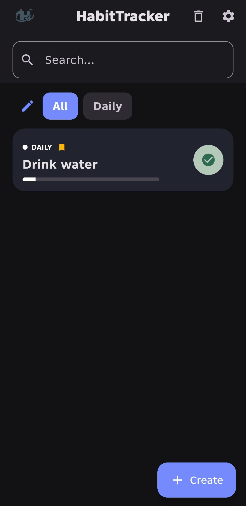
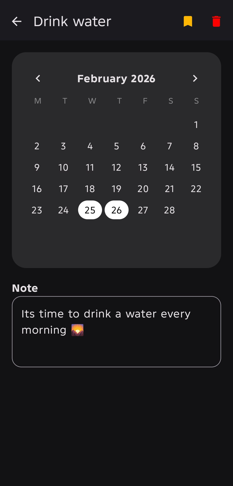
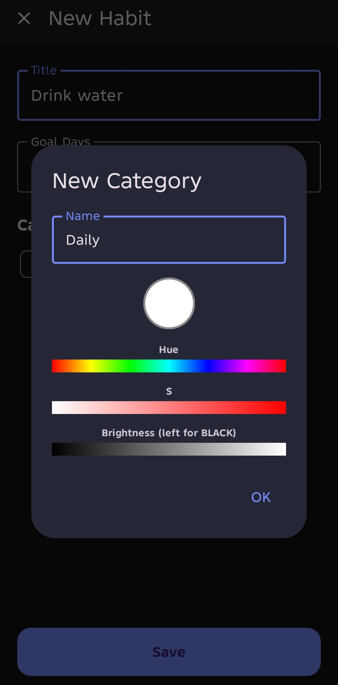
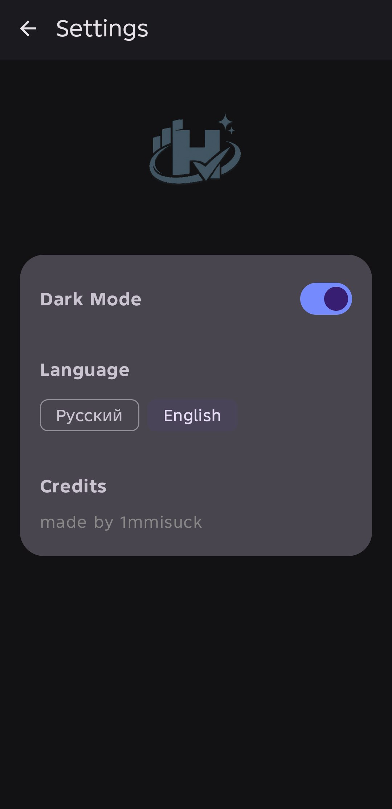

# 📌 HabitTracker — Твой путь к идеальной дисциплине


**HabitTracker** — это полноценная интерактивная система для формирования полезных привычек, разработанная с упором на максимальную производительность, эстетику и глубокую персонализацию.

---

## 📲 Скачать приложение
[](https://github.com/1mmisuck/HabitTrack/releases/download/HabitTrack/HabitTrack.apk)

---

## 🚀 Основная суть
Приложение превращает рутину в визуально приятный процесс. Главная фишка — **полная свобода**: вы сами создаете структуру категорий, выбираете любые цвета через продвинутую палитру и управляете приоритетами в одно касание.

---

## 📸 Галерея интерфейса

| Главный экран | Детали привычки | Выбор цвета | Настройки |
|:---:|:---:|:---:|:---:|
|  |  |  |  |
|  |  |  | |

---

## 🔥 Ключевые возможности

### ⚡ Экстремальная оптимизация
- **Zero Lag UI:** Использование `derivedStateOf` и интеллектуального рендеринга для мгновенной работы даже при огромном списке задач.
- **Smooth Persistence:** Асинхронная работа с базой данных Room — приложение никогда не зависает при сохранении.
- **Плавный ввод:** Оптимизированные заметки с буферизацией — текст печатается мягко, без задержек.

### 🎭 Анимации и Интерактив
- **Fluid Transitions:** Плавные переходы между экранами и визуальный отклик каждого элемента.
- **Dynamic Progress:** Живое заполнение шкалы прогресса, которое мотивирует двигаться дальше.

### 🎨 Персонализация без границ
- **HSV Color Picker:** Полноценная палитра для категорий — выбирайте любой оттенок от чисто белого до глубокого черного.
- **Кастомная сортировка:** Меняйте категории местами в редакторе, определяя их порядок в главном меню.

### 📅 Умный календарь
- **Полная навигация:** Переключайте месяцы и годы, чтобы отслеживать историю.
- **Ручное управление:** Возможность отмечать выполнение за любой прошедший день прямо в сетке календаря.
- **Midnight Reset:** Кружки на главном экране обнуляются ровно в полночь, стимулируя новую активность.

### 🛠 Умный функционал
- **Избранное:** Закрепляйте самые важные привычки вверху списка.
- **Корзина (Bin):** Удаленные привычки и категории не пропадают — их всегда можно восстановить.
- **Глобальный поиск:** Мгновенный поиск по названию в реальном времени.

---

## 🌍 Локализация и темы
Приложение полностью адаптировано под ваши предпочтения:
*   **Языки:** Полная поддержка **Русского 🇷🇺** и **English 🇺🇸** (меняется всё: от кнопок до календаря).
*   **Темы:** Выверенная **Светлая** и стильная **Темная** темы для комфортной работы в любое время суток.
*   **Persistence:** Все настройки темы, языка и порядка категорий сохраняются навсегда.

---

## 🛠 Технологический стек
*   **UI:** Jetpack Compose (Material 3)
*   **Architecture:** MVVM (ViewModel, StateFlow)
*   **Database:** Room (SQLite)
*   **Navigation:** Compose Navigation
*   **Storage:** SharedPreferences

---

## 🏗 Как запустить
1. Клонируйте репозиторий:
   ```bash
   git clone https://github.com/1mmisuck/HabitTracker.git

    Откройте проект в Android Studio.

    Убедитесь, что у вас установлен JDK 17+.

    Запустите на эмуляторе или устройстве с API 26 или выше.

👨‍💻 Автор

Разработано нетрезвым под веществами.

<div align="center">
<b>Made by 1mmisuck</b>
</div>
